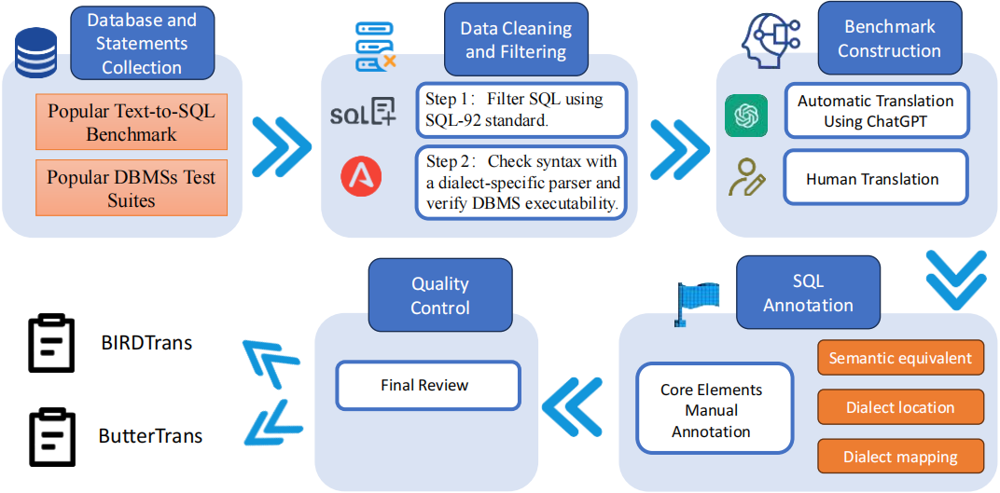
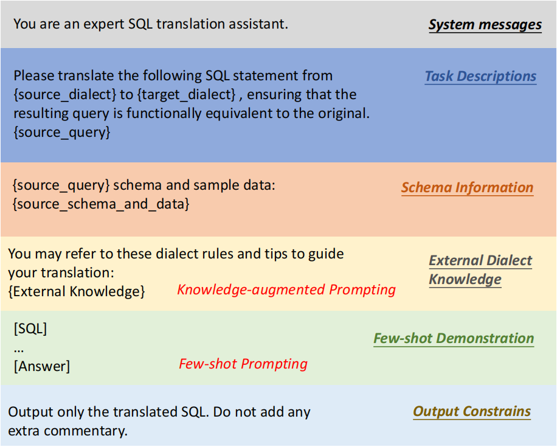

# DLBENCH: A Comprehensive Benchmark for SQL Translation with Large Language Models
DLBENCH is a comprehensive benchmark for evaluating the SQL translation capabilities of Large Language Models (LLMs). It contains 6,402 translation tasks across seven popular DBMSs and 9,320 SQL dialects, covering both real-world and diverse synthetic scenarios. The quality and difficulty of DLBENCH are validated through a rigorous multi-step cleaning process and cross-checked by both LLM-based and human annotations. Please check our [Leaderboard](https://dlbenchll.github.io/leaderboard.html) for a visualization of the evaluation results.

## Benchmark Dataset

DLBENCH includes two comprehensive SQL translation datasets: **BIRDTRANS** and **BUTTERTRANS**. These datasets cover a diverse range of SQL queries across multiple relational DBMS dialects, carefully selected to reflect both real-world and synthetic query scenarios.

The benchmark dataset is accessible at `./datasets`. We provide two types of datasets based on their data sources and dialect coverage:

- **BIRDTRANS**: Derived from the BIRD benchmark (SQLite dialect), containing 3,206 translation tasks across 4,669 dialect variants.
- **BUTTERTRANS**: Collected from official MySQL and PostgreSQL test suites, containing 3,196 translation tasks across 4,651 dialect-specific instances.

Each dataset supports translation to six widely-used open-source DBMSs: **MySQL**, **PostgreSQL**, **MariaDB**, **MonetDB**, **DuckDB**, and **ClickHouse**.

Below is the structure of the dataset directory:
```swift
./datasets/
├── BIRDTrans/
│ ├── mysql.json
│ ├── mariadb.json
│ ├── ...
│ └── schemas/
│ ├──── mysql/
│ ├────── app_store.txt
│ └────── ...
│ └──── ...
│ └──── duckdb/
├── BUTTERTrans/
│ ├── mysql.json
│ ├── monetdb.json
│ ├── ...
│ └── schemas/
│ ├──── mysql/
│ ├────── BUTTERTrans_1.txt
│ └────── ...
│ └──── ...
└ └──── duckdb/
```
Each translation task contains the following fields:

- `sql_id`: The unique identifier for each SQL translation task.
- `database_name`: The name of the database associated with the task, corresponding to a schema file in `./schemas/{source_dbms}/{database_name}.txt`.
- `source_dbms`: The source DBMS name (possible values: `sqlite`, `mysql`, `postgresql`).
- `target_dbms`: The target DBMS name (possible values: `mysql`, `mariadb`, `postgresql`, `clickhouse`, `monetdb`, `duckdb`).
- `source_query`: The original SQL query to be translated.
- `target_query`: The ground truth translated SQL query for the target DBMS.
- `semantic_equivalent_type`: The semantic equivalence type of the translation (`exact_equivalence` or `appr_equivalence`).
- `source_query_dialect_token_positions`: The positions of dialect-specific tokens in the source query.
- `source_dialect_knowledge`: Detailed knowledge of each dialect token in the source DBMS.
- `target_dialect_knowledge`: The corresponding mapping of each dialect token in the target DBMS.
- `source_related_schemas`: Schema information for the source DBMS environment.
- `target_related_schemas`: Schema information for the target DBMS environment.

Here is an example translation task:

```json
{
  "sql_id": 1,
  "database_name": "app_store",
  "source_dbms": "sqlite",
  "target_dbms": "clickhouse",
  "source_query": "SELECT CAST(SUM(CASE WHEN SUBSTR('Last Updated', -4) > '2018' THEN 1 ELSE 0 END) AS REAL) * 100 / COUNT(App) PER FROM playstore WHERE Type = 'Free' AND Rating >= 4.5",
  "target_query": "SELECT SUM(CASE WHEN substring('Last Updated', -4) > '2018' THEN 1 ELSE 0 END) * 100 / COUNT(`App`) AS `PER` FROM `playstore` WHERE `_Type` = 'Free' AND `Rating` >= 4.5;",
  "semantic_equivalent_type": "exact_equivalence",
  "source_query_dialect_token_positions": [
            {
                "dialect_token": "SUBSTR",
                "start_pos": 26,
                "end_pos": 32
            }
        ],
        "source_dialect_knowledge": [
            {
                "feature": "substr(X,Y,Z)substr(X,Y)substring(X,Y,Z)substring(X,Y)",
                "explanation": "The substr(X,Y,Z) function returns a substring of input string X that begins\n  with the Y-th character and which is Z characters long.\n  If Z is omitted then substr(X,Y) returns all characters through the end\n  of the string X beginning with the Y-th.\n  The left-most character of X is number 1.  If Y is negative\n  then the first character of the substring is found by counting from the\n  right rather than the left.  If Z is negative then\n  the abs(Z) characters preceding the Y-th character are returned.\n  If X is a string then characters indices refer to actual UTF-8 \n  characters.  If X is a BLOB then the indices refer to bytes.\n  \n  \"substring()\" is an alias for \"substr()\" beginning with SQLite version 3.34.\n",
                "examples": [
                    "SELECT substr('Hello World', 1, 5); -- Returns 'Hello'",
                    "SELECT substr('Hello World', -5, 3); -- Returns 'Wor'"
                ]
            }
        ],
        "target_dialect_knowledge": [
            {
                "feature": "substring(str, start, length) | substring(str, start)",
                "explanation": "The substring(str, start, length) function extracts a substring from the given string str. It starts at position start and extracts length characters. If length is omitted, the function returns the substring from start to the end of the string. The first character in ClickHouse is indexed as 1, similar to SQLite. If start is negative, it counts from the end of the string.",
                "examples": [
                    "SELECT substring('Hello World', 1, 5); -- Returns 'Hello'",
                    "SELECT substring('Hello World', -5, 3); -- Returns 'Wor'"
                ]
            }
        ],
        "source_related_schemas": [
            "Table: `playstore`\nColumns:\n(`App`, text)\n(`Category`, text)\n(`Rating`, real)\n(`Reviews`, integer)\n(`Size`, text)\n(`Installs`, text)\n(`Type`, text)\n(`Price`, text)\n(`Content Rating`, text)\n(`Genres`, text)\n(`rowid`, integer, primary key)\n"
        ],
        "target_related_schemas": [
            "Table: `playstore`\nColumns:\n(`App`, String)\n(`Category`, String)\n(`Rating`, Float64)\n(`Reviews`, Int64)\n(`Size`, String)\n(`Installs`, String)\n(`_Type`, String)\n(`Price`, String)\n(`Content_Rating`, String)\n(`Genres`, String)\n(`rowid`, Int64, primary key)\n"
        ]
}
```
DLBENCH ensures the dataset's quality through SQL92-based validation, dialect-specific parsing, and both LLM-based and human annotations. For a detailed comparison of LLM performance on these tasks, please visit our [Leaderboard](https://dlbenchll.github.io/leaderboard.html).

## Annotation Process


## Usage
### Setup
To set up the environment for running DLBench, please follow the instructions below:
1. Install the required dependencies listed in requirements.txt:
```bash
pip install -r requirements.txt 
```
2. Deploy the DBMSs participating in SQL Translation, supported DBMSs include:
- SQLite
- MySQL
- MariaDB
- PostgreSQL
- ClickHouse
- MonetDB
- DuckDB

3. Deploy the large language models (LLMs) to be tested, supported LLMs are:
- sqlcoder:7b
- codellama:7b-instruct
- deepseek-coder:6.7b-instruct
- deepseek-r1:8b-llama-distill-q8_0
- gpt-3.5-turbo
> Note: The four open source LLMs (`sqlcoder:7b`, `codellama:7b-instruct`, `deepseek-coder:6.7b-instruct`, `deepseek-r1:8b-llama-distill-q8_0`) can be deployed through Ollama.

4. Download the benchmark datasets and schema files:
```bash
git clone https://github.com/DLBenchll/DLBench.git
cd DLBench
```

5. Verify the dataset directory structure under `./datasets/` and the configurations under `./resource` to ensure all required files are present.

### Inference
To run SQL translation inference with a specific Large Language Model on DLBench, use the provided `inference.py` script. The script accepts several arguments to control the inference process:

| Argument              | Description                                                                                                  |
| --------------------- |--------------------------------------------------------------------------------------------------------------|
| `--model_config_path` | **(Required)** Path to the YAML config file for the tested LLM (e.g., `codellama:7b-instruct.yaml`).         |
| `--input_data_path`   | **(Required)** Path to the JSON file containing SQL translation tasks.                                       |
| `--schema_dir_path`   | Path to the directory containing schema files (one `{database_name}.txt` file per schema).                   |
| `--db_config_path`    | Path to the YAML file specifying DBMS connection parameters.                                                 |
| `--output_dir`        | Directory to save the inference outputs (e.g., the translated queries and the inference context of the LLM). |
| `--log_file_path`     | Path to the log file (default: `./logs/default.log`).                                                        |
| `--use_fs`            | Enable using few-shot prompting examples to improve LLM performance. Requires `--few_shots_dir`.             |
| `--use_ka`            | Enable using augmented-knowledge from the `input_data` to improve LLM performance.                                                  |
| `--few_shots_dir`     | Directory containing few-shot examples. Each JSON file should be named `{source_dbms}_{target_dbms}.json`.   |

#### Prompt Template
The default prompt template in DLBench consists of six components: `System Messages`, `Task Descriptions`, `Schema Information`, `External Dialect Knowledge`, `Few-shot Demonstrations`, and `Output Constraints`. Among them, `System Messages`, `Task Descriptions`, `Schema Information`, `Few-shot Demonstrations`, and `Output Constraints` are mandatory components. `External Dialect Knowledge` will be included when the `--use_ka` argument is specified, and `Few-shot Demonstrations` will be included when the `--use_fs` argument is enabled.


#### Example Usage
```bash
python3 inference.py \
  --model_config_path ./resources/model_configs/gpt-3.5-turbo.yaml \
  --input_data_path ./test/data_clickhouse.json \
  --schema_dir_path ./datasets/BIRDTrans/schemas/ \
  --db_config_path ./resources/dbms_configs.yaml \
  --output_dir ./outputs/test/ \
  --log_file_path ./outputs/logs/inference.log \
  --use_fs \
  --use_ka \
  --few_shots_dir ./resources/few_shots/
```
#### Example Model Configuration
```yaml
model_name: "gpt-3.5-turbo"
temperature: 0.0
http_proxy: ""
https_proxy: ""
openai_api_key: "<Your OpenAI API Key>"
openai_api_base: "https://api.openai.com/v1"
```
Only `model_name` and `temperature` are mandatory. Other configuration parameters depend on the specific implementation of the model API. The project provides implementations and configuration references for five models (see: `../app/models/basic_models.py` and `./resources/model_configs/*.yaml`).

Users may also extend additional model interfaces by inheriting and implementing the `BasicModel class` defined in `./app/models/basic_models.py`, and registering the new model builder method in `./app/models/model_builder.py`. A corresponding config file must also be added for the new model.

#### Example Input Data
```json
{
    "sql_id": 1,
    "database_name": "app_store",
    "source_dbms": "sqlite",
    "target_dbms": "clickhouse",
    "source_query": "SELECT CAST(SUM(CASE WHEN SUBSTR('Last Updated', -4) > '2018' THEN 1 ELSE 0 END) AS REAL) * 100 / COUNT(App) PER FROM playstore WHERE Type = 'Free' AND Rating >= 4.5",
    "source_dialect_knowledge": [...],
    "target_dialect_knowledge": [...],
    "source_related_schemas": [...],
    "target_related_schemas": [...]
}
```
Note: The input data must contain the fields listed above. The meaning and formatting requirements for these fields follow the definitions in DLBench. If `--use_ka` is not specified, `source_dialect_knowledge` and `target_dialect_knowledge` can be left empty.

#### Example Schema and DBMS Configuration
Both of these parameters are optional. If you wish to validate the execution of the generated SQL queries, both `schema_dir_path` and `db_config_path` must be provided.
The `schema_dir_path` parameter specifies a directory containing schema files (one `.txt` file per schema, with one SQL statement per line for constructing the schema execution environment).
For each translation task, you can locate the corresponding source schema file via: `{schema_dir_path}/{source_dbms}/{database_name}.txt`, and likewise find the target schema file for the generated query.

After obtaining the schema files, the SQL statements within are executed to build the test environment, and both the `source_query` and `predicted_query` are executed against it. DBMS drivers are initialized based on parameters specified in the `db_config_path` YAML file, an example of which is shown below:
```yaml
sqlite:
  db_path: "./outputs/db.raw_sqlite"
clickhouse:
  username: "admin"
  password: "123456"
  host: "127.0.0.1"
  port: 8123
# ... (other DBMS configurations)
```
In addition to the six built-in DBMS drivers provided by the project, support for additional DBMSs can also be extended by implementing the `DBDriver class` defined in `./app/db_drivers/basic_drivers.py`, registering the new driver constructor method in `./app/db_drivers/driver_builder.py`, and providing the necessary configuration parameters in the configuration file.

#### Example Output
The `output_dir` argument specifies the output directory. An `output.json` file will be generated in this directory, containing the `predicted_query`, inference context (`raw_response`), and optionally execution results (`source_query_result` and `predicted_query_result`). An example is shown below:
```json
{
    "sql_id": 1,
    "source_dbms": "sqlite",
    "target_dbms": "clickhouse",
    "source_query": "SELECT CAST(SUM(CASE WHEN SUBSTR('Last Updated', -4) > '2018' THEN 1 ELSE 0 END) AS REAL) * 100 / COUNT(App) PER FROM playstore WHERE Type = 'Free' AND Rating >= 4.5",
    "predicted_query": "SELECT (CAST(SUM(CASE WHEN substring('Last Updated', -4) > '2018' THEN 1 ELSE 0 END) AS Float64) * 100) / COUNT(App) AS PER FROM playstore WHERE _Type = 'Free' AND Rating >= 4.5",
    "source_query_result": {
        "result": [
            "(100.000000)"
        ],
        "row_count": -1,
        "err": null
    },
    "predicted_query_result": {
        "result": [
            "(100.000000)"
        ],
        "row_count": 1,
        "err": null
    },
    "raw_response": {
        "role": "assistant",
        "content": "```sql\nSELECT (CAST(SUM(CASE WHEN substring('Last Updated', -4) > '2018' THEN 1 ELSE 0 END) AS Float64) * 100) / COUNT(App) AS PER\nFROM playstore\nWHERE _Type = 'Free' AND Rating >= 4.5\n```"
    }
}
```

### Example Log
```text
INFO 06/19/2025 10:48:15 Loading model...
INFO 06/19/2025 10:48:15 Model (gpt-3.5-turbo) loaded from ./resources/model_configs/gpt-3.5-turbo.yaml
INFO 06/19/2025 10:48:15 Loading dataset...
INFO 06/19/2025 10:48:15 Input data loaded from ./test/data_clickhouse.json.
INFO 06/19/2025 10:48:15 Loading database drivers...
INFO 06/19/2025 10:48:15 Start inferring...
INFO 06/19/2025 10:48:15 [BIRDTrans_1] Translating from sqlite to clickhouse...
INFO 06/19/2025 10:48:18 [BIRDTrans_1] Source query: SELECT CAST(SUM(CASE WHEN SUBSTR('Last Updated', -4) > '2018' THEN 1 ELSE 0 END) AS REAL) * 100 / COUNT(App) PER FROM playstore WHERE Type = 'Free' AND Rating >= 4.5
INFO 06/19/2025 10:48:18 [BIRDTrans_1] Translated query: SELECT (CAST(SUM(CASE WHEN substring('Last Updated', -4) > '2018' THEN 1 ELSE 0 END) AS Float64) * 100) / COUNT(App) AS PER FROM playstore WHERE _Type = 'Free' AND Rating >= 4.5
INFO 06/19/2025 10:48:18 Execute transferred query...
INFO 06/19/2025 10:48:22 [BIRDTrans_1] Query execution completed.
INFO 06/19/2025 10:48:22 Inference completed. Results saved to ./outputs/test/output.json
```

### Example few-shot prompts
Both `--use_fs` and `--few_shots_dir` are optional parameters. If few-shot prompting is to be used to enhance model performance, both parameters must be provided.
The `few_shots_dir` parameter specifies a directory path containing several JSON files. Each JSON file corresponds to a specific `{source_dbms}` to `{target_dbms}` translation scenario, and should be named `{source_dbms}_{target_dbms}.json`. An example format is shown below:

```json
[
  [
    {
      "role": "system",
      "content": "You are an expert SQL translation assistant.Let's think step by step."
    },
    {
      "role": "user",
      "content": "[Task Descriptions]:...\n[SQL statement]: ...\n[Schema Information]:\nsqlite schema: ...\nclickhouse schema: ..."
    },
    {
      "role": "assistant",
      "content": "..."
    }
  ],
  ...(Three few-shot prompts)
]
```

### Evaluation
We provide the `evaluation.py` script to evaluate the performance of Large Language Models on the DLBench dataset. The arguments for this script are mostly identical to those of `inference.py`, with two additional parameters: `--dataset_path` to specify the dataset to evaluate, `--dm_matching_keywords_path` to specify the keyword file used for calculating the `DM (Dialect Matching)` metric, and `--resume` to enable resuming from incomplete evaluations.

The available arguments for `evaluation.py` are listed below:

| Argument              | Description                                                                                                  |
|-----------------------|--------------------------------------------------------------------------------------------------------------|
| `--model_config_path` | **(Required)** Path to the YAML config file for the tested LLM (e.g., `codellama:7b-instruct.yaml`).         |
| `--dataset_path`      | **(Required)** Path to the DLBench dataset to be tested (e.g., `./datasets/BIRDTrans/clickhouse.json`).      |
| `--schema_dir_path`   | Path to the directory containing schema files (one `{database_name}.txt` file per schema).                   |
| `--db_config_path`    | Path to the YAML file specifying DBMS connection parameters.                                                 |
| `--dm_matching_keywords_path`       | Path to the matching keywords file which contains the keywords used to calculate DM.                         |
| `--output_dir`        | Directory to save the inference outputs (e.g., the translated queries and the inference context of the LLM). |
| `--log_file_path`     | Path to the log file (default: `./logs/default.log`).                                                        |
| `--use_fs`            | Enable using few-shot prompting examples to improve LLM performance. Requires `--few_shots_dir`.             |
| `--use_ka`            | Enable using augmented-knowledge from the `input_data` to improve LLM performance.                           |
| `--few_shots_dir`     | Directory containing few-shot examples. Each JSON file should be named `{source_dbms}_{target_dbms}.json`.   |
| `--resume`     | Enable resuming from previous incomplete evaluation.                                                         |

The `--dataset_path` parameter should point to a specific DLBench dataset JSON file containing a list of translation tasks, each strictly following the DLBench format (see `# Benchmark Dataset` for details).
The `--dm_matching_keywords_path` parameter specifies a JSON file containing the dialect keyword mappings used to compute the `DM (Dialect Matching)` metric. This file defines, for each dialect token, the set of keywords expected to appear in the translated `predicted_query` for a given `target_dbms`. The presence of these keywords indicates whether a dialect-specific feature has been properly converted.

An example of this keywords file:
```json
{
  "RANK": {
    "sqlite": {
      "expression": "rank()",
      "matching_keyword": [
        "rank(",
        "RANK("
      ]
    },
    "mysql": {
      "expression": "RANK()",
      "matching_keyword": [
        "rank(",
        "RANK("
      ]
    },
    ...
  },
  ...
}
```
For example, when translating a query containing the `RANK` token to MySQL, the evaluation process will check whether the generated `predicted_query` contains either `rank(` or `RANK(` to determine if the dialect-specific feature was correctly translated.

Such keyword mapping files should be constructed manually based on the dialect knowledge mappings. The project provides ready-to-use keyword files for the **BIRDTrans** and **BUTTERTrans** datasets, located at `./resources/BIRDTrans_dm_keywords.json` and `./resources/BUTTERTrans_dm_keywords.json` respectively.

#### Example Usage
```bash
python3 evaluation.py \
  --model_config_path ./resources/model_configs/gpt-3.5-turbo.yaml \
  --datasest_path ./datasets/BIRDTrans/clickhouse.json \
  --schema_dir_path ./datasets/BIRDTrans/schemas/ \
  --db_config_path ./resources/dbms_configs.yaml \
  --dm_matching_keywords_path ./resources/BIRDTrans_dm_keywords.json
  --output_dir ./outputs/BIRDTrans/clickhouse/fs/ \
  --log_file_path ./outputs/logs/evaluation.log \
  --use_fs \
  --few_shots_dir ./resources/few_shots/
  --resume
```
After executing `evaluation.py`, two result files will be generated in the `output_dir`:

- `output.jsonl`: records the translation result, query execution outputs, and inference context for each task.
- `eval_result.json`: reports the evaluation metrics computed on the dataset.

#### Example `output.jsonl` entry:
```json lines
{"sql_id": 1, "source_dbms": "sqlite", "target_dbms": "clickhouse", "source_query": "SELECT CAST(SUM(CASE WHEN SUBSTR('Last Updated', -4) > '2018' THEN 1 ELSE 0 END) AS REAL) * 100 / COUNT(App) PER FROM playstore WHERE Type = 'Free' AND Rating >= 4.5", "predicted_query": "SELECT (CAST(SUM(CASE WHEN SUBSTRING('Last Updated', -4) > '2018' THEN 1 ELSE 0 END) AS Float64) * 100) / COUNT(App) AS PER FROM playstore WHERE _Type = 'Free' AND Rating >= 4.5", "source_query_result": {"result": ["(100.0)"], "row_count": 1, "err": null}, "predicted_query_result": {"result": ["(100.0)"], "row_count": 1, "err": null}, "raw_response": {"model": "gpt-3.5-turbo", "message": {"role": "assistant", "content": "SELECT (CAST(SUM(CASE WHEN SUBSTRING('Last Updated', -4) > '2018' THEN 1 ELSE 0 END) AS Float64) * 100) / COUNT(App) AS PER FROM playstore WHERE _Type = 'Free' AND Rating >= 4.5"}}}
{"sql_id": 2, "source_dbms": "sqlite", "target_dbms": "clickhouse", "source_query": "SELECT FullName FROM Conference ORDER BY LENGTH(FullName) DESC LIMIT 1", "predicted_query": "SELECT FullName FROM Conference ORDER BY length(FullName) DESC LIMIT 1", "source_query_result": {"result": ["('Proceedings of the International IFIP-IEEE Conference on Broadband Communications, Global Infrastructure for the Information Age')"], "row_count": 1, "err": null}, "predicted_query_result": {"result": ["('Proceedings of the International IFIP-IEEE Conference on Broadband Communications, Global Infrastructure for the Information Age')"], "row_count": 1, "err": null}, "raw_response": {"model": "gpt-3.5-turbo", "message": {"role": "assistant", "content": "SELECT FullName FROM Conference ORDER BY length(FullName) DESC LIMIT 1"}}}
...
```

#### Example `eval_result.json` content:
```json
{
    "P_DM": "0.41434262948207173(416/(416+588))",
    "R_DM": "0.5636856368563685(416/(416+322))",
    "F1_DM": "0.47761194029850745",
    "EM": "0.043478260869565216(28/644)",
    "EX": "0.44254658385093165(285/644)"
}
```
Where:
- `DM (Dialect Matching)` measures how accurately dialect-specific tokens are preserved in the translated queries.
- `EM (Exact Matching)` indicates the percentage of generated queries that exactly match the ground truth.
- `EX (Execution Accuracy)` reflects the percentage of translated queries that produce the same execution result as the original query.
